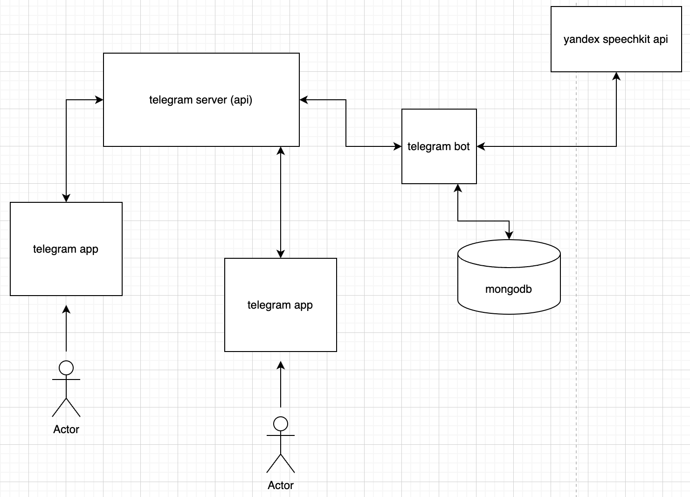

# Артемий (Джейн) вещает

## Описание

Телеграм бот, который озвучивает присылаемые ему сообщения. Озвучивает голосом Anton.
Опционально - распознавание голосовых сообщений. Пользователь имеет возможность установить настройки 
(выбрать голос, тональность, скорость). Аутентификация по секретному ключу (секретному слову).

Ссылки:
- https://core.telegram.org/bots/api
- https://cloud.yandex.com/en/services/speechkit
- https://telegraf.js.org/

## Сценарии пользовательских сессий

### Вариант 1 - синтез текста

Пользователь в чате с ботом отправляет текст "привет, как дела, хорошая сегодня погода". Бот, синтезировав
речь с помощью яндекса, отправляет в ответ аудио файл, содержащий отправленный текст. Текст озвучен голосом
Jane.

### Вариант 2 - изменение настроек

Пользователь, выполнив специальную команду (/settings) получает возможность изменить голос озвучки (выбрав
один из предложенных, а также тональность и скорость).

### Варинат 3 - распознавание голоса

Пользователь пересылает голосовое сообщение от другого пользователя боту, бот, используя API яндекса 
распознает речь и присылает текстовое сообщение, содержащее речь в аудио файле.

## Возможности продукта

### Аутентификация

Пользователь при начале работы с ботом должен передать секретное слово, иначе бот игнорирует все 
передаваемые ему команды.

## Техническая реализация

Общая архитектура системы выглядит следующим образом:

### Принципиальная схема взаимодействия

При получении сообщения от пользователя бот определяет команду (распознавание, синтез или изменение настроек)
и выполняет соответствующий запрос: либо к стороннему API (яндексу), либо к базе данных для обновления 
настроек пользователя.